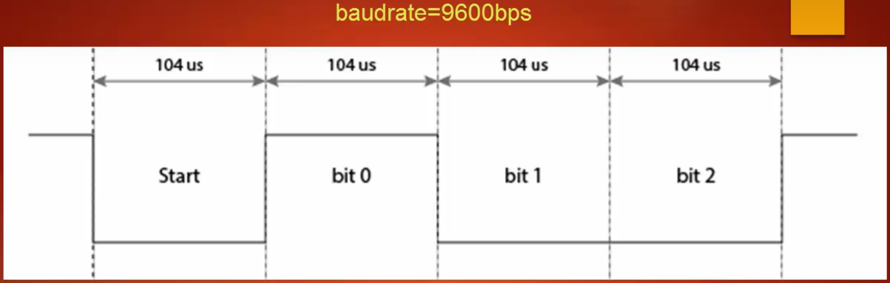
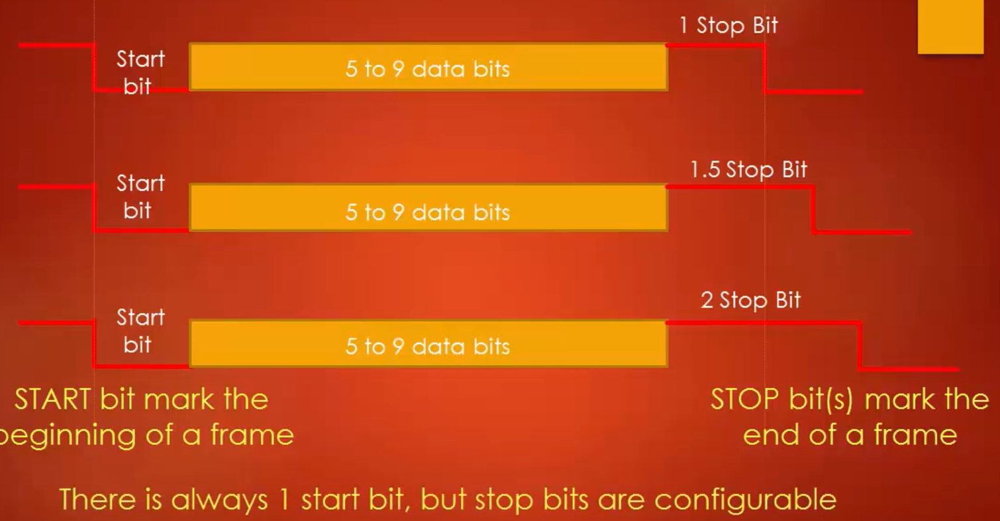
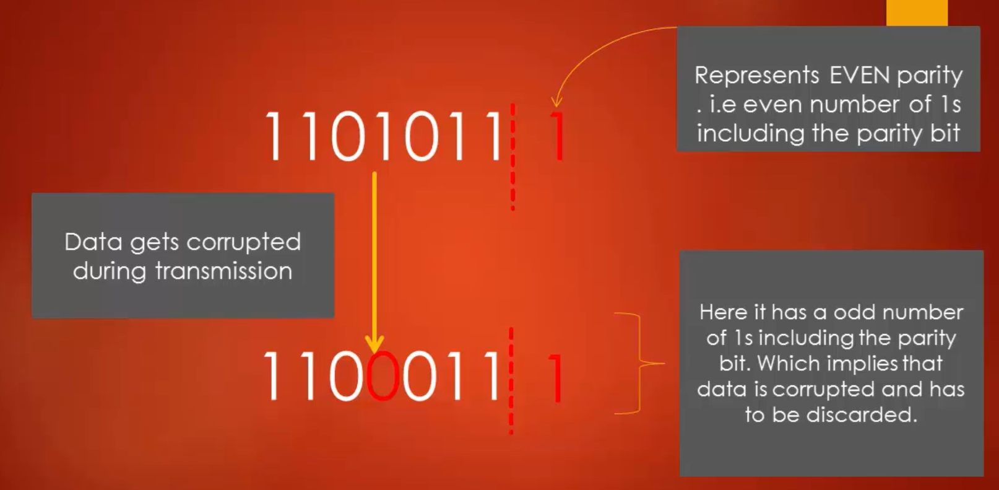

## Introduciton of UART and USART
**UART**- Universal Asynchronous receiver transmitter: supports only asynchronous mode

**USART** - Universal Synchronous Asynchronous Receiver Transmitter: support both asynchronous and synchronous modes

There is no specified port for USART communication. They are commonly used in conjugation with protocol like RS-232, RS-434, USB etc

In synchronous transmission, the clock is sent separately from the data stream and no start/stop bits are used.

#### USART hardware components
- Baudrate generator
- TX and RX shift registers
- Transmit/Receive control blocks
- Transmit/Receive buffers
- First-in, first-out (FIFO) buffer memory

USART is just a piece of hardware in your microcontroller which transmits and receives data bits either in Synchronous mode or in Asynchronous mode

If it is Asynchronous mode, then clock will not be sent along with the data, instead we use synchronization bits like start and stop along with the useful data.

#### Understanding UART pins

#### UART frame formats

#### Baud Rate
The significance of baud rate is how fast the data is sent over a serial line. it's usually expressed in units of bits-per-second (bps). If you invert the baud rate you can find out, just how long it takes to transmit a single bit. This value determines how long the transmitter holds a serial line high or low.

Both transmitting as well as receveing devices shoudl operate at the same rate.

The baud rates are usually depending up on the peripheral clock frequency of the UART peripheral

#### Synchronization bits

The start bit is always indicated by an idle data line going from high to low. Stop bit will transition back to the idle state which is HIGH

#### UART Parity
Adding Parity is a simplest method of error detection. Parity is simply the number of ines appearing in the binary form of a number.

Even parity results in even number of 1s, whereas odd parity results in odd number of 1s, when counted including the parity bit.

## UART Working

#### Steps to do Data Transmission
1. Program the M bit in USART_CR1 to define the word length
2. Program the number of stop bits in USART_CR2 register
3. Select the desired baud rate using the USART_BRR register
4. Set the TE bit in USART_CR1 to enable the transmit block
5. Enable the USART by writing the UE bit in USART_CR1
6. Now if txe flag is set, then write the data byte to send, in the USART_DR register
7. After writing the last data into the USART_DR register, wait until TC=1. (Transmission Complete)

#### Steps to do Dat Reception
1. Program the M bit in USART_CR1 to define the word length
2. Program the number of stop bits in USART_CR2 register
3. Select the desired baud rate using the USART_BRR register
4. Enable the USART by writing the UE bit in the USART_CR1
5. Set the RE bit in the USART_CR1 register, which enables the receiver block of the usart peripheral
6. when a charater is received, wait till the RXNE bit is set and read data byte from the data register.
7. The RXNE bit must be cleared by reading the data register, before the end of the reception of the next character to avoid overrun error.